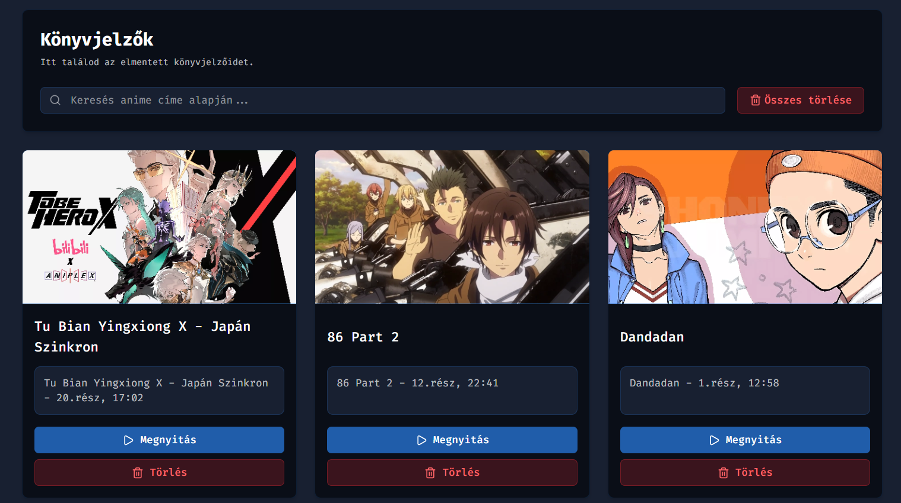

# Könyvjelzők

## Mi ez és mire jó?

A Könyvjelzők funkcióval egy kattintással elmentheted kedvenc jeleneteidet egy adott epizódban.
Így később azonnal visszaugorhatsz ezekhez a pontokhoz.

---

## Bekapcsolás

Beállítások → „Könyvjelzők & Előzmények” fül → Könyvjelzők → Kapcsoló.
Alapértelmezett: engedélyezve.

---

## Könyvjelző hozzáadása a lejátszóban

- A lejátszó vezérlősávján megjelenő könyvjelző ikonra kattintva az aktuális időponthoz könyvjelzőt hozol létre.
- A könyvjelző az adott anime címéhez és epizódjához kapcsolódik.

---

## Könyvjelzők kezelése

- Keresés: cím vagy a könyvjelző leírása alapján szűr.
- Műveletek:
    - Lejátszás ikon: megnyitja a részt és az elmentett időpontra ugrik.
    - Kuka ikon: törli a könyvjelzőt.
    - Összes törlése: minden könyvjelző törlése megerősítéssel.

---

## Hibaelhárítás

- Nem látszik a könyvjelző gomb a lejátszóban:
    - Ellenőrizd, hogy a könyvjelzők engedélyezve vannak-e és hogy a „Fejlesztői beállítások → Lejátszó típusa” értéke „plyr”.
    - Töltsd újra az oldalt.
- Nem mentődik a könyvjelző:
    - Nézd meg a böngésző konzolt, hogy látszik-e hiba. (engedélyezd a „Fejlesztői beállítások → Konzol naplózást”)

