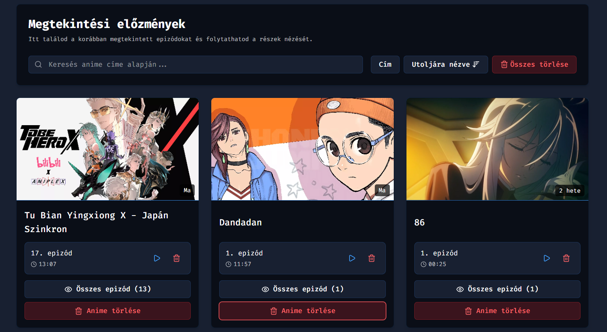

# Előzmények / Folytatás

## Mi ez és mire jó?

Az Előzmények (Folytatás) funkció automatikusan elmenti, hogy mely epizódokból hol tartasz. Visszatéréskor onnan
folytathatod, ahol abbahagytad.

---

## Bekapcsolás és módok

Beállítások → „Könyvjelzők & Előzmények” fül → Előzmények / Folytatás.
Alapértelmezett: engedélyezve.

- Mód:
    - ask (alap): rákérdez, hogy folytassa-e az elmentett pozícióról.
    - auto: kérdés nélkül az elmentett időpontra ugrik.
- Automatikus törlés: 1w | 1m | 3m | 1y | never (alap: 1m).
    - A megadott időnél régebben frissített epizódok automatikusan törlődnek.
    - `1w`: 1 hét, `1m`: 1 hónap, `3m`: 3 hónap, `1y`: 1 év, `never`: soha.

---

## Hogyan működik?

- Automatikusan menti az adatokat, amikor egy megállítod a videót, vagy elhagyod az oldalt.
- Adatok anime szerint csoportosítva; egy animén belül több epizód külön-külön pozícióval.
- A legutóbb frissített epizód gyorsan elérhető marad.
- Automatikus törli az epizód adatait, ha az "Automatikus következő epizód" funkció aktív és ez váltja az epizódot.

---

## Előzmények oldal – kezelés

- Keresés: cím alapján szűr; gépelés közben azonnal frissül.
- Rendezés:
    - Cím (A–Z / Z–A)
    - Utoljára nézve (növekvő / csökkenő)
    - A gomb ismételt kattintása váltja a sorrendet.
- Műveletek:
    - Lejátszás ikon egy epizódon: új lapon megnyit és az elmentett időpontra ugrik.
    - Kuka ikon egy epizódon: eltávolítja az előzményből.
    - Anime törlése: az adott anime összes epizódját eltávolítja az előzményekből.
    - Összes törlése: minden előzmény törlése.

---

## Hibaelhárítás

- Nem folytatja az elmentett pozícióról:
    - Ellenőrizd, hogy az Előzmények/folytatás engedélyezett-e. ("ask" módban rá kell nyomni a "Folytatás" gombra.)
    - Töltsd újra az oldalt.
- Nem frissülnek az előzmények:
    - Ellenőrizd a konzolt (kapcsold be: Fejlesztői beállítások → Konzol naplózás).

