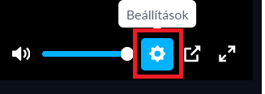
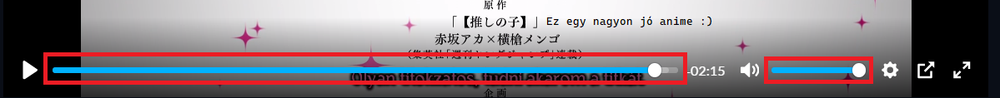
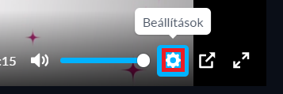
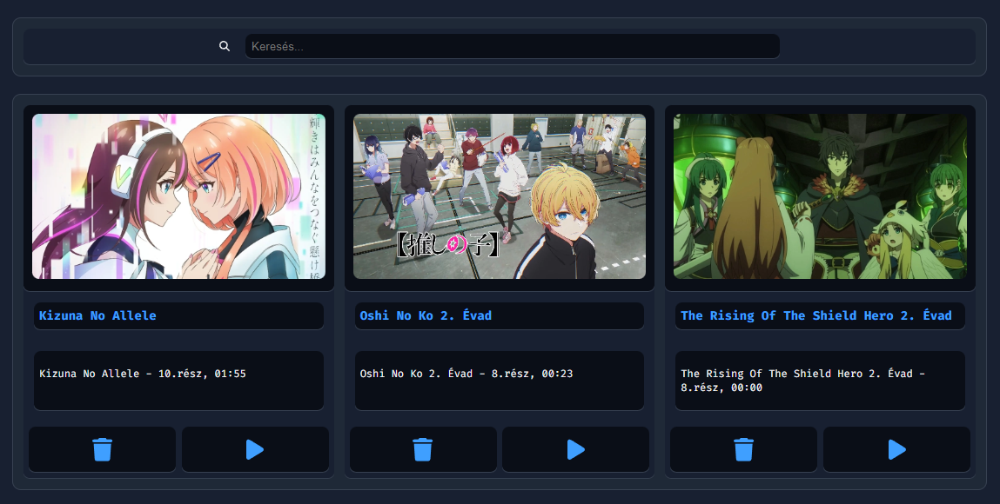
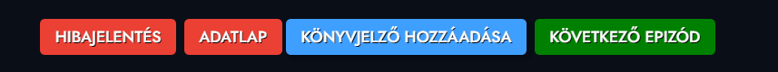
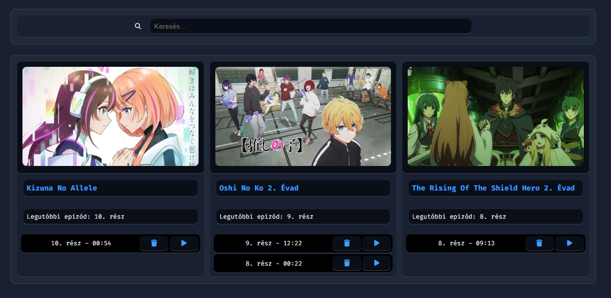

# Részletes magyarázat a beállításokhoz

<small><i>Image by Ecsi</i></small>

## Általános beállítások

### Előre ugrás
- **Engeedélyezve**: Ki/be kapcsolja az előre ugrást.
- **Ugrás hossza**: Az előre ugrás hossza másodpercben.
- **Billentyűkombináció**: A billentyűkombináció, amivel az előre ugrás aktiválható.

### Hátra ugrás
- **Engeedélyezve**: Ki/be kapcsolja a hátra ugrást.
- **Ugrás hossza**: A hátra ugrás hossza másodpercben.
- **Billentyűkombináció**: A billentyűkombináció, amivel a hátra ugrás aktiválható.

### Következő rész
- **Engeedélyezve**: Ki/be kapcsolja a következő részre ugrást.
- **Billentyűkombináció**: A billentyűkombináció, amivel a következő részre ugrás aktiválható.
> Ha az utolsó résznél vagy, akkor az anime adatlapjára ugrik.

### Előző rész
- **Engeedélyezve**: Ki/be kapcsolja az előző részre ugrást.
- **Billentyűkombináció**: A billentyűkombináció, amivel az előző részre ugrás aktiválható.
> Ha az első résznél vagy, akkor az anime adatlapjára ugrik.

### Automatikus következő rész
- **Engeedélyezve**: Ki/be kapcsolja az automatikus következő részre ugrást.
- **Idő**: Az idő másodpercben, amikor az automatikus következő részre ugrás aktiválódik. (0 = A rész vége után)
> Ha az érték negatív, akkor úgy értelmezi, mintha 0 lenne.

### Automatikus lejátszás
- **Engeedélyezve**: Ki/be kapcsolja az automatikus lejátszást.

### Könyvjelzők beállításai
- **Engeedélyezve**: Ki/be kapcsolja a könyvjelzőket.

### Előzmények beállításai
- **Engeedélyezve**: Ki/be kapcsolja a Előzményeket.
- **Legördülő menü**:
    - **Kérdezzen rá minden alkalommal**: Mindig kérdezzen rá, hogy folymatassa-e az adott részt.
    - **Automatikusan folytassa**: Mindig automatikusan folytassa az adott részt, kérdés nélkül.

## Haladó beállítások

### Fejlesztői beállítások
- **Engeedélyezve**: Ki/be kapcsolja a fejlesztői beállításokat.
- **Console log**
    - **Engeedélyezve**: Ki/be kapcsolja a konzol logolást.
- **Alapértelmezett lejátszó**
    - **< legördülő lista >**: A lejátszó, amit alapértelmezetten használ a kiegészítő. (Ezek: `plyr`, `Alapértelmezett`)
> - `Alapértelmezett`: Nem cseréli le a lejátszót. (Pl: indavideonál marad az indavideo lejátszó)
> - `plyr`: Plyr lejátszóra cseréli le a lejátszót. (Ez egy lejátszó, amit a kiegészítő használ)

### Letöltési név
- **Fájlnév sablon**: A fájlnév sablonja, amit a letöltésnél használ.
    - A használható változók:
        - `%title%`: Az anime címe.
        - `%episode%`: A rész sorszáma.
        - `%0episode%`: A rész sorszáma 0-val kiegészítve. (Pl: 01)
        - `%MAT%`: "MATweaks" szöveg. (Ez a kiegészítő neve, ha nem tudtad volna :D)
        - `%quality%`: A videó minősége. (Pl: 1080p)
        - `%fansub%`: A csapat neve, aki feliratozta az animét.
        - `%source%`: Az oldal neve, ahonnan az anime linkje származik.
    
### Plyr
- **Engeedélyezve**: Ki/be kapcsolja az egyedi kinézetet a plyr lejátszónál.
- **SVG szín**: Az ikonok színe a plyr lejátszónál. (képen pirossal jelölve)

- **Háttérszín**: Az ikonok háttérszíne amikor rávisszük az egeret. (képen pirossal jelölve)

- **Főszín**: A hang és a progress bar színe. (képen pirossal jelölve)

- **Szín**: Az ikonok színe, amikor rávisszük az egeret. (képen pirossal jelölve)

# Könyvjelzők

- **Keresés**: Itt tudsz keresni a könyvjelzők között.
    - 500ms után automatikusan keresni fog, ha írsz valamit a keresőbe.
    - Illetve a `Enter` lenyomásával is keresni fog.
    - Ha nem talál semmit, akkor egy piros színű üzenetet fog kiírni. (Ezt: `Nincs találat.`)
- **Könyvjelzők**: Minden egyes könyvjelző leírásában van, hogy melyik animénél, melyik résznél és azon belül hányadik percnél van a könyvjelző.
- **Gombok**:  
    - **Törlés**: Törli a könyvjelzőt. (egy kék kuka ikon)
    - **Elindítás**: Megnyitja az adott könyvjelzőt. (egy lejátszó ikon)
- **Könyvjelző hozzáadása**: A lejátszó alatt található egy gomb, amit megnyomva hozzáadhatsz egy könyvjelzőt a jelenlegi időponthoz. (`KÖNYVJELZŐ HOZZÁADÁSA` gomb)

# Előzmények

- **Keresés**: Itt tudsz keresni az előzmények között.
    - 500ms után automatikusan keresni fog, ha írsz valamit a keresőbe.
    - Illetve a `Enter` lenyomásával is keresni fog.
    - Ha nem talál semmit, akkor egy piros színű üzenetet fog kiírni. (Ezt: `Nincs találat.`)
- **Előzmények**: Itt anime szerint vannak csoportosítva az előzmények, és ezek alatt vannak a részek.
- **Részek**: Minden egyes rész leírásában van, hogy hanyaadik rész volt és hányadik percnél tartottál.
- **Gombok**:  
    - **Törlés**: Törli az adott rész előzményét. (egy kék kuka ikon)
    - **Elindítás**: Megnyitja az adott részt. (egy lejátszó ikon)
- **Hozzáadás**: Ez a funkció automatikusan működik, nem kell külön hozzáadni semmit. (Ha a beállításokban engedélyezve van az előzmények funkció)

# Egyéb
- **Mentés**: A beállítások mentése.
- **Visszaállítás**: Az utolsó mentett beállítások visszaállítása.
- **Alapértelmezett**: Az alap beállítások visszaállítása.
- **Segítség**: Erre az oldalra hoz.

