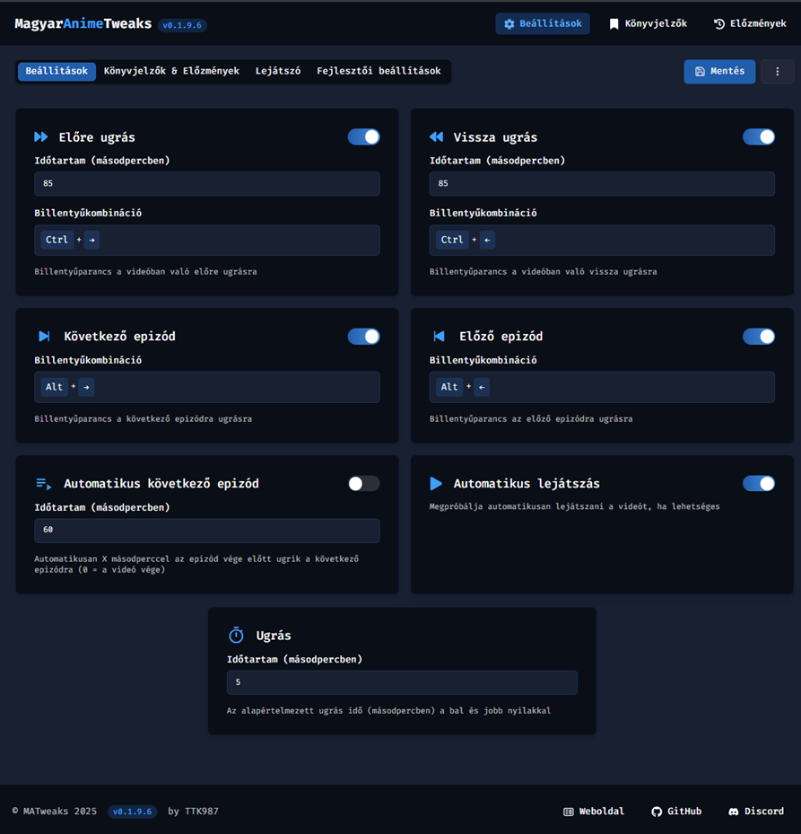

# Részletes magyarázat a beállításokhoz

Ez a dokumentum a jelenlegi (v0.1.9.x) kód alapján készült.



## Fő felépítés (fülek / Tabok)

1. Beállítások: Lejátszással kapcsolatos gyors funkciók.
2. Könyvjelzők & Előzmények: Könyvjelzők és Előzmények funkciók beállításai.
3. Lejátszó: Plyr testreszabás (színek vagy egyedi CSS).
4. Fejlesztői beállítások: Konzol naplózás, lejátszó típusa, letöltési fájlnév sablon.

A jobb felső sarokban található menü:
- Mentés: Aktuális állapot mentése.
- Visszaállítás: Visszaáll az utoljára mentett állapotra.
- Alapértelmezett: Betölti a gyári alapbeállításokat.
- Segítség: Megnyitja ezt a fájlt GitHubon.

---
## 1. Beállítások fül

### Előre ugrás
- Engedélyezve: Alapértelmezett: true.
- Ugrás hossza: Alapértelmezett: 85 mp. Tartomány: 0 – 300.
- Billentyűkombináció: Alapértelmezett: Ctrl + Jobb nyíl.
- Funkció: A megadott időt előre tekeri.

### Vissza ugrás
- Engedélyezve: Alapértelmezett: true.
- Ugrás hossza: Alapértelmezett: 85 mp. Tartomány: 0 – 300.
- Billentyűkombináció: Ctrl + Bal nyíl.
- Funkció: A megadott időt visszaugrik.

### Következő epizód
- Engedélyezve: Alapértelmezett: true.
- Billentyűkombináció: Alt + Jobb nyíl.
- Ha az utolsó elérhető résznél vagy: az anime adatlapjára lép.

### Előző epizód
- Engedélyezve: Alapértelmezett: true.
- Billentyűkombináció: Alt + Bal nyíl.
- Ha az első résznél vagy: az anime adatlapjára lép.

### Automatikus következő epizód
- Engedélyezve: Alapértelmezett: false.
- Idő: Alapértelmezett: 60 mp. Jelentése: hátralévő idő ennyivel a rész vége előtt vált (0 = a videó vége után).
- Negatív érték kezelése: 0-ként értelmezi.
- Utolsó rész esetén: az anime adatlapjára lép.

### Automatikus lejátszás
- Engedélyezve: Alapértelmezett: true.
- Megpróbálja automatikusan elindítani a videót (forrás és állapot függő sikeresség).

### Ugrás
- Idő: Alapértelmezett: 5 mp. Tartomány: 0 – 300.
- Leírás: Simán a Bal / Jobb nyíl lenyomására ennyit ugrik (független az előre/vissza ugrás funkcióktól).

---
## 2. Könyvjelzők & Előzmények fül

### Könyvjelzők
- Engedélyezve: Alapértelmezett: true.
- Funkció: Lejátszó alatt gomb jelenik meg (KÖNYVJELZŐ HOZZÁADÁSA).
- Tárolt adatok: anime címe, rész sorszám, időpont, leírás.

### Előzmények / Folytatás
- Engedélyezve: Alapértelmezett: true.
- Mód: ask | auto. Alapértelmezett: ask.
  - ask: Rákérdez folytatáskor.
  - auto: Automatikusan folytatja.
- Automatikus törlés: 1w | 1m | 3m | 1y | never. Alapértelmezett: 1m.
  - Ha ennyi ideig nincs frissítve egy elkezdett rész, akkor törlődik.
  - Jelentése: 1w = 1 hét, 1m = 1 hónap, 3m = 3 hónap, 1y = 1 év, never = soha.

---
## 3. Lejátszó fül (Plyr testreszabás)

### Design engedélyezése
- Alapértelmezett: false.
- Ha kikapcsolt: gyári Plyr stílus (vagy alapértelmezett oldal lejátszó, ha a player típus nem Plyr).

### Szerkesztési módok
- Egyszerű mód: Színválasztók. A kód a CSS-ben lévő `--plyr-*` változókat cseréli.
- Haladó mód: Közvetlen CSS szerkesztő. Karakter szám jelző + figyelmeztetések.
  - Figyelmeztetés > 8000 karakternél.
  - Mentés sikertelen lesz > 10000 karakternél.

### Alapértelmezett CSS változók (részlet)
```
--plyr-color-main              Fő akcent szín
--plyr-video-background        Háttér
--plyr-badge-background        Badge háttér
--plyr-badge-text-color        Badge szöveg
--plyr-video-control-color     Ikon szín
--plyr-video-control-color-hover  Ikon szín hover
--plyr-menu-background         Menü háttér
--plyr-menu-color              Menü szöveg
--plyr-menu-arrow-color        Menü nyíl
--plyr-menu-border-color       Menü keret
--plyr-menu-border-shadow-color Menü shadow
--plyr-menu-back-border-color  Menü vissza keret
--plyr-range-fill-background   Csúszka kitöltés
--plyr-progress-loading-background Betöltés sáv
--plyr-video-progress-buffered-background Buffer sáv
--plyr-range-thumb-background  Csúszka pötty
--plyr-video-range-thumb-active-shadow-color Aktív pötty shadow
--plyr-tooltip-background      Tooltip háttér
--plyr-tooltip-color           Tooltip szöveg
```

### CSS mentés szabályok
- HTML tagek eltávolítva (biztonsági tisztítás).
- 10000 karakternél hosszabb CSS: Nem kerül mentésre.
- Visszaállítás gomb: Alapértelmezett CSS visszatöltése.

#### Előnézet
- Jobb oldali panelen valós időben lehet látni a változtatásokat.

---
## 4. Fejlesztői beállítások fül

### Konzol naplózás
- Alapértelmezett: false.
- Ha engedélyezve: plusz diagnosztikai üzenetek a böngésző konzolban (hibakeresés).


### Lejátszó típusa
- Lehetséges értékek: plyr | default. Alapértelmezett: plyr.
- Ha default: nem blokkolja az oldal saját lejátszó scriptjeit (a bővítmény több funkciója inaktív lehet). Gyakorlatilag a MATweaks videó player részének kikapcsolása.


### Early Access Program (EAP)
- Alapértelmezett: false.
- Ha engedélyezve: bizonyos kísérleti funkciók elérhetővé válnak.
- Az `Engedélyezett funkciók` alatt fel vannak sorolva az elérhető EAP funkciók (ha vannak).
- Az ide kerülő funkciók nagyrészt stabilak, de előfordulhatnak hibák, illetve a jövőben változhatnak.


### Letöltés fájlnév sablon
- Alapértelmezett: `%title% - %episode%.rész (%MAT%)`
- Változók:
  -`%title%`  Anime címe
  - `%episode%` Epizód száma (pl. 1)
  - `%0episode%` Epizód száma vezető nullával (pl. 01)
  - `%MAT%`  "MATweaks" szöveg
  - `%source%` Forrás / oldal neve (pl. indavideo)
  - `%quality%` Videó minősége (pl. 720p)
  - `%group%` Fansub csoport(ok) neve (ha nincs: "Ismeretlen")
- Példa eredmény: `One Piece - 01.rész (MATweaks)`
